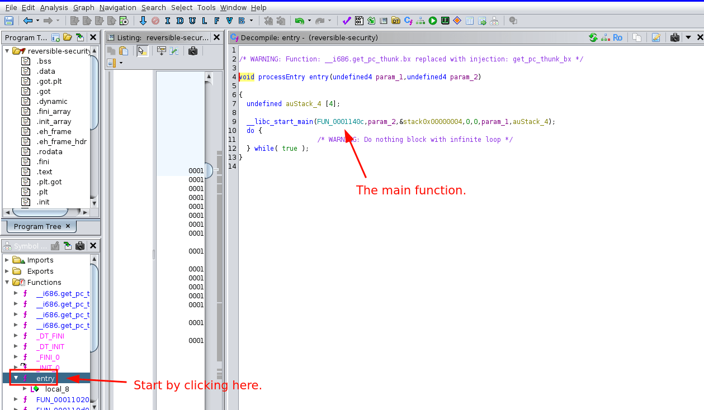
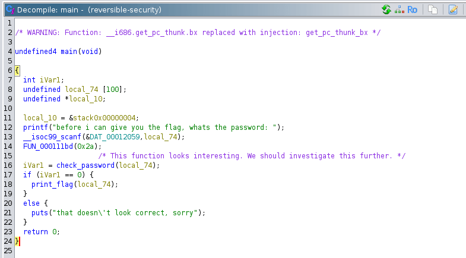
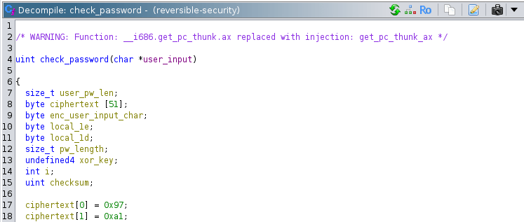
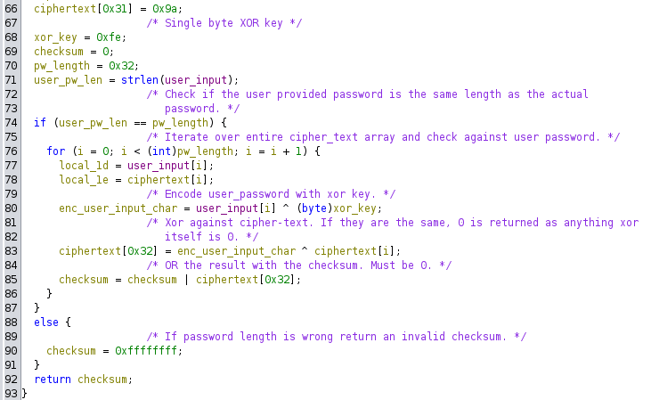
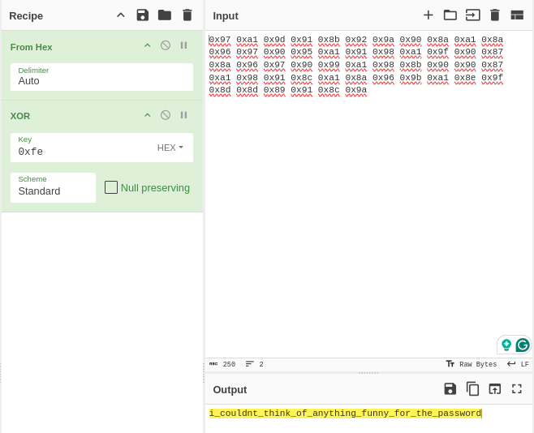
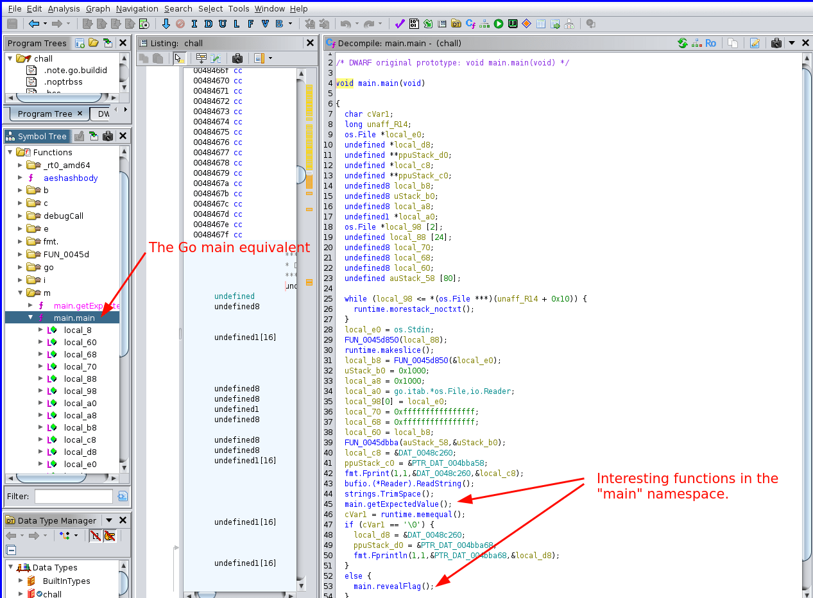
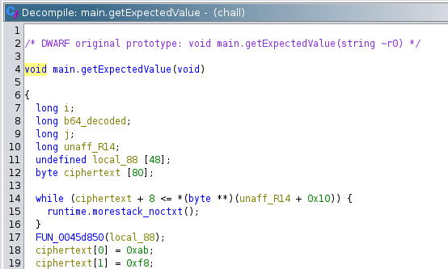
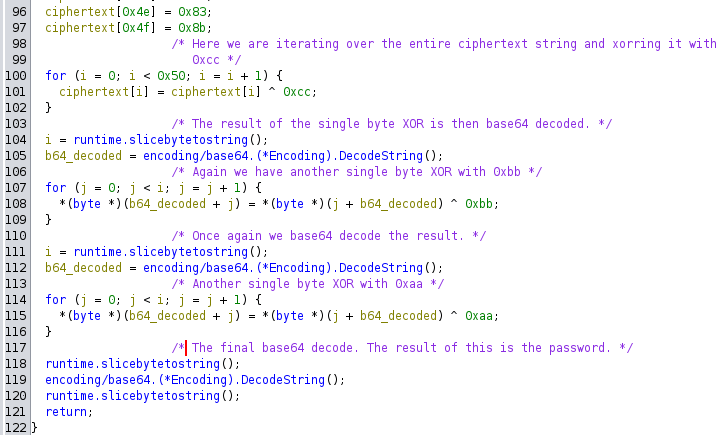
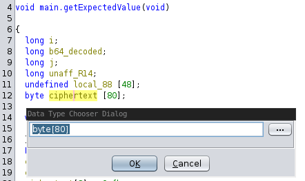
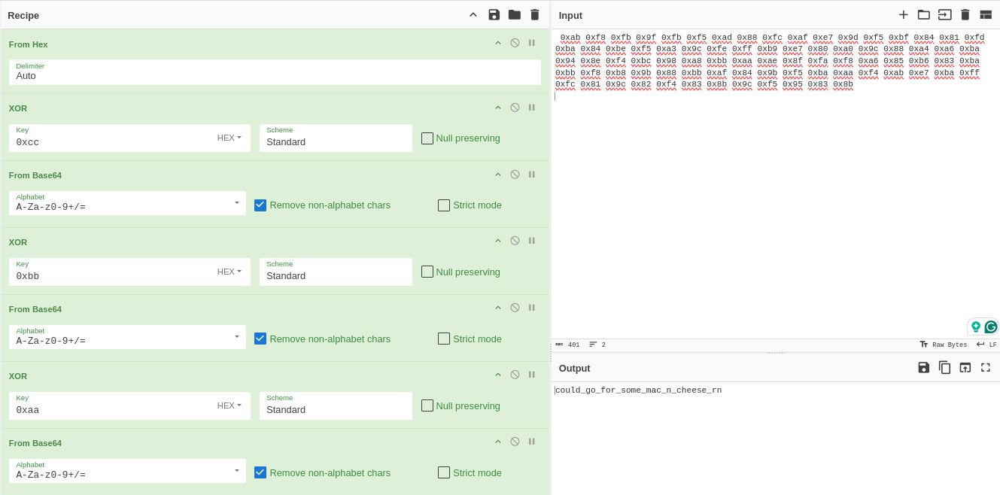

Challenge author walkthrough of the reverse engineering homework for UCSC's CSE-132 Fall 2024 class. While there are multiple approaches to solving these challenges, including both dynamic and static analysis, our primary goal was to help you develop your static code analysis skills. These challenges were specifically designed to be solved through static analysis, without needing to execute the code.

<!-- more -->

## Reversible Security
!!! info annotate "Challenge Description"
    There should be an easy way to reverse this and get the password?

    Consider: 0xDEADBEEF ^ 0xFBAD = 0xDEAC0402

    Then: 0xDEAC0402 ^ 0xFBAD = 0xDEADBEEF

    Provided: ./chall (1)

1. chall: ELF 32-bit LSB pie executable, Intel 80386, version 1 (SYSV), dynamically linked, interpreter /lib/ld-linux.so.2, BuildID[sha1]=3b77c0bd6fc04a4abb900db88c950f182b9dcf10, for GNU/Linux 3.2.0, stripped


After first downloading the Reversible Security `chall` file, making it executable with `chmod +x ./chall`, and running the binary, we can see that this binary requires a password to get the flag:

```bash
$ ./chall
before i can give you the flag, whats the password: random
that doesn't look correct, sorry
```

While we don't know what the password is, we can use some simple reverse engineering to find it using a static analysis tool Ghidra. After importing this binary to Ghidra and analyzing it with default settings, we can head to the `entry` function, found either through the functions tree, or the default keybind to jump within Ghidra, ++g++, followed by typing `entry`. We start with this function because the binary is stripped, so the `main` function isn't named.

We can find `main` by looking at `entry`'s call to `__libc_start_main`, where the first argument is `main`.



After adding some labels to this function to make things more readable, we can see that this program will first print out the prompt we saw when running this program and asking for user input. It then will check the password provided by the user and only print the flag if this `check_password` function returns 0.

Since our password wasn't correct, it printed "that doesn't look correct, sorry".



Double clicking on the `check_password` function, we can see that a fairly large hex string is stored within the function. Later in the function, a for loop is used to verify that our `user_password` is equal to the decrypted password. More information about this in the code below.



Cutting out the ciphertext bytes for readability.



As mentioned above, this function uses a single byte XOR to encode the password. In single byte XOR, a single byte such as `0xfe` is XOR'd with text to create the ciphertext. **One of XOR's properties is self-inverse, which means that any operation we apply can be applied again to invert the previous operation**. Since we have a ciphertext array that has been XOR'd by `0xfe`, we can decode this by once again XORing the array with `0xfe`.

To do this, we can use [CyberChef](https://gchq.github.io/CyberChef/) with the following recipe which gives us the password of `i_couldnt_think_of_anything_funny_for_the_password`:



Passing this password to the binary after running it once again, we successfully get the flag:
```bash
$ ./chall
before i can give you the flag, whats the password: i_couldnt_think_of_anything_funny_for_the_password
here is your reward: cse132{h0p3fu11y_y0u_u53d_cyb3rch3f_f0r_th15}
```

## A New Language
!!! info annotate "Challenge Description"
    GO Lang? More like GO to the polls!

    Get it?? Why aren't you laughing...

    Provided: ./chall (1)

1. chall: ELF 64-bit LSB executable, x86-64, version 1 (SYSV), statically linked, Go BuildID=ZGSbk_aqGNi7XmwnsVOD/BqYkN_OelsBGbQof4f7w/cJ__74Va7IS7eGfghfoK/U7l5hxbtlhx3TH6WYvQN, with debug_info, not stripped


Like the previous challenge, this binary can be solved with some reverse engineering. In this challenge, however, the password is encoded slightly more than in the past challenge and the binary is a golang binary.

To start, we can once again open up this binary in Ghidra. This time, instead of navigating to the `entry` function however, we can navigate the Golang main equivalent, `main.main`. We can also get an idea of what other custom functions are included in this binary by checking all functions under the `main.*` namespace. In this case however, the relevant functions are shown within the `main.main` function.

Looking at the `main.main` function, we can see two interesting function calls. The first function, `main.getExpectedValue` could have something to do with validating the password based on the if statement following it. In the else case of this if statement is the `main.revealFlag`, which based on the function name, has a pretty obvious functionality.



Without delving too deeply into the `main.main` function, we can shift over to the `main.getExpectedValue` function to discover what the password is.

Looking at the contents of the `main.getExpectedValue` function (after some cleanup), we once again see a long cipher text string. This time however, there are 3 single byte XOR loops followed by a base64 decodes.



Ciphertext array once again cut for readability.



It is worth noting that if you originally had issues with extracting the hex strings, as they were not displayed as individual bytes, you can resize the array by right-clicking on the `byte ciphertext[]` array and clicking "Retype Variable". In this menu, you can update the size to the correct `0x50` (80 in decimal) that we can see above in the first for loop. This will result in a correctly displayed `ciphertext` array without requiring any changes in endianness.



Now that we understand the sequence to decrypt the ciphertext string in this function, we can create a CyberChef recipe to decode the password. To copy over the bytes, I simply copied every ciphertext line (for example `ciphertext[0] = 0xab;`) and reformatted it to contain just the hex byte using vim.


After adding in the sequence shown above, we get the password: `could_go_for_some_mac_n_cheese_rn`

Now that we have the password, running the binary and entering the password gives us the flag:

```bash
$ ./chall
yo yo whats the password: could_go_for_some_mac_n_cheese_rn
yoooo you got it, heres the flag for u
cse132{w45_th4t_50_h4rd_n0w_g0_d0_c0d3br34k3r}
```

