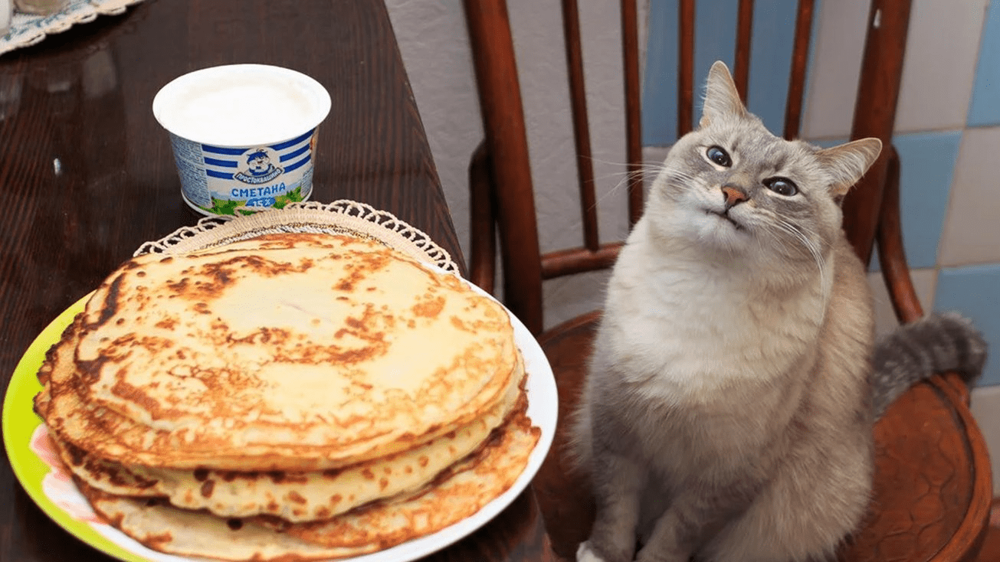

This is a test post.

<!-- more -->

## References
List of usable markdown features available and their documentation:

- [References](https://squidfunk.github.io/mkdocs-material/reference/)
- [Mermaid.js](https://mermaid.js.org/intro/)
- [Pymdown Extensions](https://facelessuser.github.io/pymdown-extensions/extensions/arithmatex/)
- [MathJax](https://www.mathjax.org/)
- [Kroki](https://kroki.io/#support)
- [Plotly](https://haoda-li.github.io/mkdocs-plotly-plugin/)